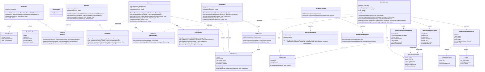

# AI Module Class Diagram

This diagram shows the architecture of the AI module following Clean Architecture patterns with external AI service integration.

```mermaid
classDiagram
    %% =========================================================
    %% API LAYER
    %% =========================================================
    class AIController {
        -IAIService _aiService
        +Ask(AskAIRequest request) Task~ActionResult~AskAIResponse~~
        +GetHistory() Task~ActionResult~IEnumerable~ChatHistoryDto~~~
        +DeleteHistory(Guid id) Task~IActionResult~
        -GetUserId() Guid
    }

    %% =========================================================
    %% APPLICATION LAYER - DTOs
    %% =========================================================
    class AskAIRequest {
        +string Prompt
    }

    class AskAIResponse {
        +string Response
        +DateTime Timestamp
        +Guid ConversationId
    }

    class ChatHistoryDto {
        +Guid Id
        +Guid UserId
        +string UserPrompt
        +string AIResponse
        +DateTime CreatedAt
    }

    %% =========================================================
    %% APPLICATION LAYER - INTERFACES
    %% =========================================================
    class IAIService {
        <<interface>>
        +AskAIAsync(Guid userId, AskAIRequest request) Task~AskAIResponse~
        +GetHistoryAsync(Guid userId) Task~IEnumerable~ChatHistoryDto~~
        +DeleteHistoryAsync(Guid userId, Guid historyId) Task
    }

    class IAIServices {
        <<interface>>
        +ProcessPromptAsync(string prompt, Guid userId) Task~string~
        +GetChatHistoryAsync(Guid userId) Task~List~ChatHistoryDto~~
        +SaveChatHistoryAsync(Guid userId, string prompt, string response) Task
        +DeleteChatHistoryAsync(Guid userId, Guid historyId) Task
    }

    class IOpenAiService {
        <<interface>>
        +GetCompletionAsync(string prompt) Task~string~
        +GetChatCompletionAsync(List~ChatMessage~ messages) Task~string~
    }

    %% =========================================================
    %% APPLICATION LAYER - SERVICES
    %% =========================================================
    class AIService {
        -IAIServices _aiServices
        -ILogger~AIService~ _logger
        +AskAIAsync(Guid userId, AskAIRequest request) Task~AskAIResponse~
        +GetHistoryAsync(Guid userId) Task~IEnumerable~ChatHistoryDto~~
        +DeleteHistoryAsync(Guid userId, Guid historyId) Task
        -MapToDto(ChatHistory chatHistory) ChatHistoryDto
    }

    class AIServices {
        -IOpenAiService _openAiService
        -IAIRepository _aiRepository
        -ILogger~AIServices~ _logger
        +ProcessPromptAsync(string prompt, Guid userId) Task~string~
        +GetChatHistoryAsync(Guid userId) Task~List~ChatHistoryDto~~
        +SaveChatHistoryAsync(Guid userId, string prompt, string response) Task
        +DeleteChatHistoryAsync(Guid userId, Guid historyId) Task
        -ValidatePrompt(string prompt) void
        -SanitizeResponse(string response) string
    }

    %% =========================================================
    %% DOMAIN LAYER - ENTITIES
    %% =========================================================
    class ChatHistory {
        +Guid Id
        +Guid UserId
        +string UserPrompt
        +string AIResponse
        +DateTime CreatedAt
        -ChatHistory()
        +ChatHistory(Guid userId, string userPrompt, string aiResponse)
    }

    %% =========================================================
    %% DOMAIN LAYER - REPOSITORIES
    %% =========================================================
    class IAIRepository {
        <<interface>>
        +SaveChatHistoryAsync(ChatHistory chatHistory) Task
        +GetChatHistoryByUserIdAsync(Guid userId) Task~List~ChatHistory~~
        +GetChatHistoryByIdAsync(Guid id) Task~ChatHistory?~
        +DeleteChatHistoryAsync(Guid id) Task
        +DeleteUserChatHistoryAsync(Guid userId) Task
    }

    %% =========================================================
    %% INFRASTRUCTURE LAYER - PERSISTENCE
    %% =========================================================
    class AIDbContext {
        +DbSet~ChatHistory~ ChatHistories
        +AIDbContext(DbContextOptions~AIDbContext~ options)
        #OnModelCreating(ModelBuilder modelBuilder) void
    }

    class AIRepository {
        -AIDbContext _context
        -ILogger~AIRepository~ _logger
        +SaveChatHistoryAsync(ChatHistory chatHistory) Task
        +GetChatHistoryByUserIdAsync(Guid userId) Task~List~ChatHistory~~
        +GetChatHistoryByIdAsync(Guid id) Task~ChatHistory?~
        +DeleteChatHistoryAsync(Guid id) Task
        +DeleteUserChatHistoryAsync(Guid userId) Task
    }

    %% =========================================================
    %% INFRASTRUCTURE LAYER - EXTERNAL SERVICES
    %% =========================================================
    class OpenAiService {
        -HttpClient _httpClient
        -IConfiguration _configuration
        -ILogger~OpenAiService~ _logger
        -string _apiKey
        -string _baseUrl
        +GetCompletionAsync(string prompt) Task~string~
        +GetChatCompletionAsync(List~ChatMessage~ messages) Task~string~
        -BuildCompletionRequest(string prompt) OpenAiCompletionRequest
        -BuildChatCompletionRequest(List~ChatMessage~ messages) OpenAiChatCompletionRequest
        -HandleApiResponse(HttpResponseMessage response) Task~string~
    }

    %% =========================================================
    %% INFRASTRUCTURE LAYER - MODELS
    %% =========================================================
    class ChatMessage {
        +string Role
        +string Content
        +ChatMessage(string role, string content)
    }

    class OpenAiCompletionRequest {
        +string Model
        +string Prompt
        +int MaxTokens
        +decimal Temperature
        +decimal TopP
        +int FrequencyPenalty
        +int PresencePenalty
    }

    class OpenAiChatCompletionRequest {
        +string Model
        +List~ChatMessage~ Messages
        +int MaxTokens
        +decimal Temperature
        +decimal TopP
        +int FrequencyPenalty
        +int PresencePenalty
    }

    class OpenAiCompletionResponse {
        +string Id
        +string Object
        +long Created
        +string Model
        +List~CompletionChoice~ Choices
        +Usage Usage
    }

    class CompletionChoice {
        +string Text
        +int Index
        +string? FinishReason
    }

    class Usage {
        +int PromptTokens
        +int CompletionTokens
        +int TotalTokens
    }

    %% =========================================================
    %% APPLICATION LAYER - EXCEPTIONS
    %% =========================================================
    class AIServiceException {
        +AIServiceException(string message)
        +AIServiceException(string message, Exception innerException)
    }

    class OpenAiApiException {
        +int StatusCode
        +string ErrorCode
        +OpenAiApiException(int statusCode, string errorCode, string message)
        +OpenAiApiException(int statusCode, string errorCode, string message, Exception innerException)
    }

    class InvalidPromptException {
        +InvalidPromptException(string message)
        +InvalidPromptException(string message, Exception innerException)
    }

    %% =========================================================
    %% APPLICATION LAYER - CONFIGURATION
    %% =========================================================
    class OpenAiConfiguration {
        +string ApiKey
        +string BaseUrl
        +string DefaultModel
        +int MaxTokens
        +decimal Temperature
        +int TimeoutSeconds
    }

    %% =========================================================
    %% RELATIONSHIPS
    %% =========================================================
    
    %% API Dependencies
    AIController --> IAIService : uses
    AIController ..> AskAIResponse : returns
    AIController ..> ChatHistoryDto : returns

    %% Service Dependencies
    AIService ..|> IAIService : implements
    AIService --> IAIServices : uses
    AIServices ..|> IAIServices : implements
    AIServices --> IOpenAiService : uses
    AIServices --> IAIRepository : uses
    AIServices --> ChatHistory : creates

    %% External Service Implementation
    OpenAiService ..|> IOpenAiService : implements
    OpenAiService --> ChatMessage : uses
    OpenAiService --> OpenAiCompletionRequest : creates
    OpenAiService --> OpenAiChatCompletionRequest : creates
    OpenAiService --> OpenAiCompletionResponse : processes
    OpenAiService --> OpenAiConfiguration : uses

    %% Repository Implementation
    AIRepository ..|> IAIRepository : implements
    AIRepository --> AIDbContext : uses
    AIRepository --> ChatHistory : manages

    %% Infrastructure Dependencies
    AIDbContext --> ChatHistory : maps

    %% Response Models
    OpenAiCompletionResponse --> CompletionChoice : contains
    OpenAiCompletionResponse --> Usage : contains

    %% Request Models
    OpenAiCompletionRequest --> OpenAiConfiguration : configured by
    OpenAiChatCompletionRequest --> OpenAiConfiguration : configured by
    OpenAiChatCompletionRequest --> ChatMessage : contains

    %% Exception Hierarchy
    AIServiceException --> OpenAiApiException : may wrap
    AIServiceException --> InvalidPromptException : may wrap

```