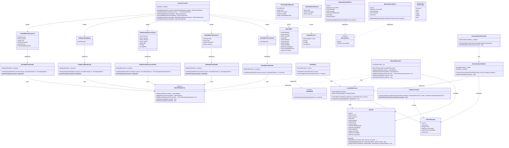

# Content Module Class Diagram

This diagram shows the architecture of the Content module following Clean Architecture and CQRS patterns.

```mermaid
classDiagram
    %% =========================================================
    %% API LAYER
    %% =========================================================
    class ContentController {
        -IMediator _mediator
        +UploadMaterial(Guid courseId, MaterialUploadRequest request) Task~IActionResult~
        +GetMaterialsByCourse(Guid courseId, ...) Task~IActionResult~
        +GetMaterialById(Guid materialId) Task~IActionResult~
        +DownloadMaterial(Guid materialId) Task~IActionResult~
        +UpdateMaterial(Guid materialId, UpdateMaterialRequest request) Task~IActionResult~
        +DeleteMaterial(Guid materialId) Task~IActionResult~
    }

    class MaterialDto {
        +Guid MaterialId
        +Guid CourseId
        +Guid? LessonId
        +string Title
        +string FileName
        +string FilePath
        +string FileType
        +long SizeInBytes
        +DateTime UploadDate
        +Guid UploadedByUserId
        +string? Description
    }

    class MaterialUploadRequest {
        +IFormFile File
        +string? Title
        +string? Description
        +string? LessonId
        +string? UploadedByUserId
    }

    class UpdateMaterialRequest {
        +string? Title
        +string? Description
        +Guid? LessonId
    }

    class PagedResult~T~ {
        +IEnumerable~T~ Data
        +int Total
        +int Page
        +int PageSize
    }

    %% =========================================================
    %% APPLICATION LAYER - COMMANDS
    %% =========================================================
    class UploadMaterialCommand {
        +Guid CourseId
        +Guid? LessonId
        +string? Title
        +string? Description
        +IFormFile File
        +Guid UploadedByUserId
    }

    class UpdateMaterialCommand {
        +Guid MaterialId
        +string? Title
        +string? Description
        +Guid? LessonId
    }

    class DeleteMaterialCommand {
        +Guid MaterialId
    }

    %% =========================================================
    %% APPLICATION LAYER - QUERIES
    %% =========================================================
    class GetMaterialByIdQuery {
        +Guid MaterialId
    }

    class GetMaterialsByCourseQuery {
        +Guid CourseId
        +Guid? LessonId
        +string? FileType
        +string? Search
        +string? Sort
        +int Page
        +int PageSize
    }

    %% =========================================================
    %% APPLICATION LAYER - HANDLERS
    %% =========================================================
    class UploadMaterialHandler {
        -IMaterialRepository _repository
        +Handle(UploadMaterialCommand request, CancellationToken ct) Task~MaterialDto~
        -MapToDto(Material material)$ MaterialDto
    }

    class GetMaterialByIdHandler {
        -IMaterialRepository _repository
        +Handle(GetMaterialByIdQuery request, CancellationToken ct) Task~MaterialDto?~
        -MapToDto(Material material)$ MaterialDto
    }

    class GetMaterialsByCourseHandler {
        -IMaterialRepository _repository
        +Handle(GetMaterialsByCourseQuery request, CancellationToken ct) Task~PagedResult~MaterialDto~~
        -MapToDto(Material material)$ MaterialDto
    }

    class UpdateMaterialHandler {
        -IMaterialRepository _repository
        +Handle(UpdateMaterialCommand request, CancellationToken ct) Task~MaterialDto?~
        -MapToDto(Material material)$ MaterialDto
    }

    class DeleteMaterialHandler {
        -IMaterialRepository _repository
        +Handle(DeleteMaterialCommand request, CancellationToken ct) Task~bool~
    }

    %% =========================================================
    %% APPLICATION LAYER - INTERFACES
    %% =========================================================
    class IUnitOfWork {
        <<interface>>
        +SaveChangesAsync(CancellationToken ct) Task~int~
    }

    %% =========================================================
    %% DOMAIN LAYER - AGGREGATES
    %% =========================================================
    class Material {
        +Guid Id
        +Guid CourseId
        +Guid? LessonId
        +string Title
        +string FileName
        +string FilePath
        +string FileType
        +Guid UploadedByUserId
        +DateTime UploadDate
        +long SizeInBytes
        +string? Description
        +DateTime CreatedAt
        +DateTime UpdatedAt
        -Material()
        +Material(Guid courseId, Guid? lessonId, string title, ...)
        +UpdateMetadata(string? title, string? description, Guid? lessonId) void
        +ReplaceFile(string fileName, string filePath, string fileType, long sizeInBytes) void
    }

    %% =========================================================
    %% DOMAIN LAYER - EVENTS
    %% =========================================================
    class IDomainEvent {
        <<interface>>
        +Guid Id
        +DateTime OccurredOn
    }

    class MaterialUploadedEvent {
        +Guid Id
        +DateTime OccurredOn
        +Guid MaterialId
        +Guid CourseId
        +Guid UploadedByUserId
        +string Title
        +string FileName
        +MaterialUploadedEvent(Guid materialId, Guid courseId, ...)
    }

    class MaterialDeletedEvent {
        +Guid Id
        +DateTime OccurredOn
        +Guid MaterialId
        +Guid CourseId
        +string Title
        +MaterialDeletedEvent(Guid materialId, Guid courseId, string title)
    }

    %% =========================================================
    %% DOMAIN LAYER - REPOSITORIES
    %% =========================================================
    class IMaterialRepository {
        <<interface>>
        +AddAsync(Material material) Task~Material~
        +GetByIdAsync(Guid materialId) Task~Material?~
        +GetByCourseIdAsync(Guid courseId, ...) Task~(IEnumerable~Material~, int)~
        +UpdateAsync(Material material) Task
        +DeleteAsync(Material material) Task
    }

    %% =========================================================
    %% DOMAIN LAYER - ENUMS
    %% =========================================================
    class MaterialType {
        <<enumeration>>
        Document
        Video
        Audio
        Image
        Archive
        Other
    }

    %% =========================================================
    %% INFRASTRUCTURE LAYER - PERSISTENCE
    %% =========================================================
    class ContentDbContext {
        +DbSet~Material~ Materials
        +DbSet~OutboxMessage~ OutboxMessages
        +ContentDbContext(DbContextOptions~ContentDbContext~ options)
        #OnModelCreating(ModelBuilder modelBuilder) void
    }

    class UnitOfWork {
        -ContentDbContext _context
        +UnitOfWork(ContentDbContext context)
        +SaveChangesAsync(CancellationToken ct) Task~int~
    }

    %% =========================================================
    %% INFRASTRUCTURE LAYER - REPOSITORIES
    %% =========================================================
    class MaterialRepository {
        -ContentDbContext _db
        +MaterialRepository(ContentDbContext db)
        +AddAsync(Material material) Task~Material~
        +GetByIdAsync(Guid materialId) Task~Material?~
        +GetByCourseIdAsync(Guid courseId, ...) Task~(IEnumerable~Material~, int)~
        +UpdateAsync(Material material) Task
        +DeleteAsync(Material material) Task
    }

    %% =========================================================
    %% INFRASTRUCTURE LAYER - OUTBOX
    %% =========================================================
    class OutboxMessage {
        +Guid Id
        +string Type
        +string Content
        +DateTime OccurredOn
        +DateTime? ProcessedOn
        +string? Error
    }

    class OutboxInterceptor {
        +SavingChangesAsync(DbContextEventData eventData, InterceptionResult~int~ result) ValueTask~InterceptionResult~int~~
        -PublishDomainEventsAsync(DbContext context)$ Task
    }

    class ContentOutboxPublisher {
        -ContentDbContext _context
        -IEventBus _eventBus
        +ContentOutboxPublisher(ContentDbContext context, IEventBus eventBus)
        +PublishPendingEventsAsync() Task
    }

    class ContentOutboxPublishJob {
        -ContentOutboxPublisher _publisher
        +ContentOutboxPublishJob(ContentOutboxPublisher publisher)
        +Execute(IJobExecutionContext context) Task
    }

    %% =========================================================
    %% RELATIONSHIPS
    %% =========================================================
    
    %% API Layer Dependencies
    ContentController --> UploadMaterialCommand : creates
    ContentController --> GetMaterialByIdQuery : creates
    ContentController --> GetMaterialsByCourseQuery : creates
    ContentController --> UpdateMaterialCommand : creates
    ContentController --> DeleteMaterialCommand : creates
    ContentController ..> MaterialDto : returns
    ContentController ..> PagedResult : returns

    %% Command/Query to Handler relationships
    UploadMaterialCommand --> UploadMaterialHandler : handled by
    GetMaterialByIdQuery --> GetMaterialByIdHandler : handled by
    GetMaterialsByCourseQuery --> GetMaterialsByCourseHandler : handled by
    UpdateMaterialCommand --> UpdateMaterialHandler : handled by
    DeleteMaterialCommand --> DeleteMaterialHandler : handled by

    %% Handler Dependencies
    UploadMaterialHandler --> IMaterialRepository : uses
    GetMaterialByIdHandler --> IMaterialRepository : uses
    GetMaterialsByCourseHandler --> IMaterialRepository : uses
    UpdateMaterialHandler --> IMaterialRepository : uses
    DeleteMaterialHandler --> IMaterialRepository : uses

    %% Domain Events
    MaterialUploadedEvent ..|> IDomainEvent : implements
    MaterialDeletedEvent ..|> IDomainEvent : implements

    %% Repository Implementation
    MaterialRepository ..|> IMaterialRepository : implements
    MaterialRepository --> ContentDbContext : uses
    MaterialRepository --> Material : manages

    %% Infrastructure Dependencies
    UnitOfWork ..|> IUnitOfWork : implements
    UnitOfWork --> ContentDbContext : uses
    ContentDbContext --> Material : maps
    ContentDbContext --> OutboxMessage : maps

    %% Outbox Pattern
    OutboxInterceptor --> OutboxMessage : creates
    ContentOutboxPublisher --> ContentDbContext : reads from
    ContentOutboxPublisher --> OutboxMessage : processes
    ContentOutboxPublishJob --> ContentOutboxPublisher : uses


```