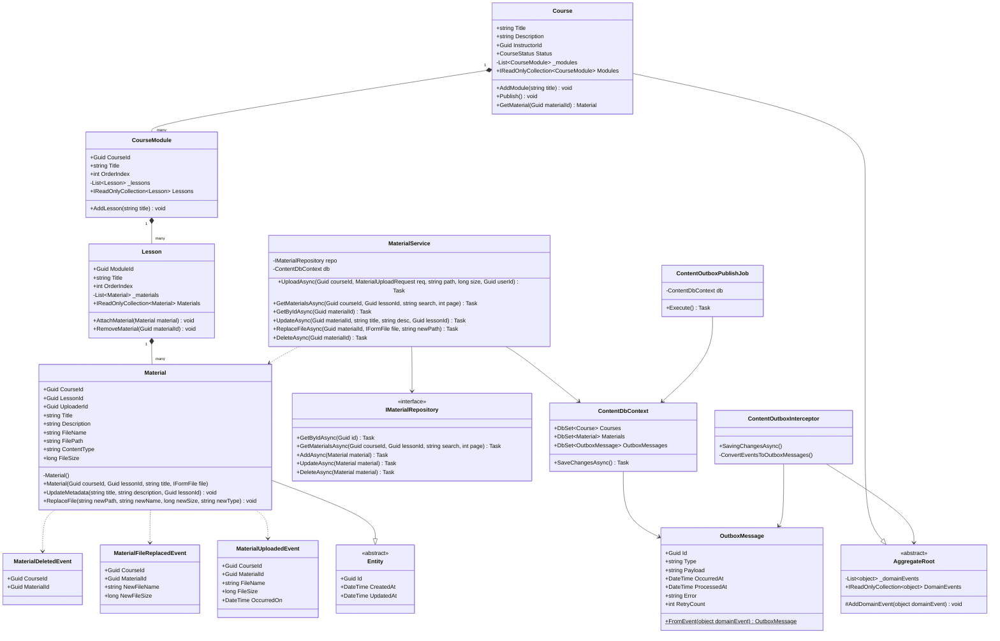

```mermaid
classDiagram
    %% =========================================================
    %% 1. SHARED KERNEL
    %% =========================================================
    class AggregateRoot {
        <<abstract>>
        -List~object~ _domainEvents
        +IReadOnlyCollection~object~ DomainEvents
        #AddDomainEvent(object domainEvent) void
    }

    class Entity {
        <<abstract>>
        +Guid Id
        +DateTime CreatedAt
        +DateTime UpdatedAt
    }

    %% =========================================================
    %% 2. DOMAIN LAYER
    %% =========================================================
    class Course {
        +string Title
        +string Description
        +Guid InstructorId
        +CourseStatus Status
        -List~CourseModule~ _modules
        +IReadOnlyCollection~CourseModule~ Modules
        +AddModule(string title) void
        +Publish() void
        +GetMaterial(Guid materialId) Material
    }

    class CourseModule {
        +Guid CourseId
        +string Title
        +int OrderIndex
        -List~Lesson~ _lessons
        +IReadOnlyCollection~Lesson~ Lessons
        +AddLesson(string title) void
    }

    class Lesson {
        +Guid ModuleId
        +string Title
        +int OrderIndex
        -List~Material~ _materials
        +IReadOnlyCollection~Material~ Materials
        +AttachMaterial(Material material) void
        +RemoveMaterial(Guid materialId) void
    }

    class Material {
        +Guid CourseId
        +Guid LessonId
        +Guid UploaderId
        +string Title
        +string Description
        +string FileName
        +string FilePath
        +string ContentType
        +long FileSize
        -Material()
        +Material(Guid courseId, Guid lessonId, string title, IFormFile file)
        +UpdateMetadata(string title, string description, Guid lessonId) void
        +ReplaceFile(string newPath, string newName, long newSize, string newType) void
    }

    %% =========================================================
    %% 3. DOMAIN EVENTS
    %% =========================================================
    class MaterialUploadedEvent {
        +Guid CourseId
        +Guid MaterialId
        +string FileName
        +long FileSize
        +DateTime OccurredOn
    }

    class MaterialDeletedEvent {
        +Guid CourseId
        +Guid MaterialId
    }

    class MaterialFileReplacedEvent {
        +Guid CourseId
        +Guid MaterialId
        +string NewFileName
        +long NewFileSize
    }

    %% =========================================================
    %% 4. REPOSITORIES & SERVICES
    %% =========================================================
    class IMaterialRepository {
        <<interface>>
        +GetByIdAsync(Guid id) Task
        +GetMaterialsAsync(Guid courseId, Guid lessonId, string search, int page) Task
        +AddAsync(Material material) Task
        +UpdateAsync(Material material) Task
        +DeleteAsync(Material material) Task
    }

    class MaterialService {
        -IMaterialRepository repo
        -ContentDbContext db
        +UploadAsync(Guid courseId, MaterialUploadRequest req, string path, long size, Guid userId) Task
        +GetMaterialsAsync(Guid courseId, Guid lessonId, string search, int page) Task
        +GetByIdAsync(Guid materialId) Task
        +UpdateAsync(Guid materialId, string title, string desc, Guid lessonId) Task
        +ReplaceFileAsync(Guid materialId, IFormFile file, string newPath) Task
        +DeleteAsync(Guid materialId) Task
    }

    %% =========================================================
    %% 5. INFRASTRUCTURE & OUTBOX
    %% =========================================================
    class ContentDbContext {
        +DbSet~Course~ Courses
        +DbSet~Material~ Materials
        +DbSet~OutboxMessage~ OutboxMessages
        +SaveChangesAsync() Task
    }

    class OutboxMessage {
        +Guid Id
        +string Type
        +string Payload
        +DateTime OccurredAt
        +DateTime ProcessedAt
        +string Error
        +int RetryCount
        +FromEvent(object domainEvent)$ OutboxMessage
    }

    class ContentOutboxInterceptor {
        +SavingChangesAsync()
        -ConvertEventsToOutboxMessages()
    }

    class ContentOutboxPublishJob {
        -ContentDbContext db
        +Execute() Task
    }

    %% =========================================================
    %% 6. RELATIONSHIPS
    %% =========================================================
    Course --|> AggregateRoot
    Material --|> Entity

    Course "1" *-- "many" CourseModule
    CourseModule "1" *-- "many" Lesson
    Lesson "1" *-- "many" Material

    MaterialService --> IMaterialRepository
    MaterialService --> ContentDbContext
    MaterialService ..> Material

    Material ..> MaterialUploadedEvent
    Material ..> MaterialFileReplacedEvent
    Material ..> MaterialDeletedEvent

    ContentDbContext --> OutboxMessage
    ContentOutboxInterceptor --> OutboxMessage
    ContentOutboxInterceptor --> AggregateRoot
    ContentOutboxPublishJob --> ContentDbContext

    %% =========================================================
    %% 7. STYLING
    %% =========================================================
    classDef aggregate fill:#e1f5fe,stroke:#0277bd,stroke-width:2px
    classDef entity fill:#f3e5f5,stroke:#7b1fa2
    classDef domainEvent fill:#e8f5e8,stroke:#2e7d32
    classDef repository fill:#fff3e0,stroke:#ef6c00
    classDef infrastructure fill:#fce4ec,stroke:#c2185b

```
