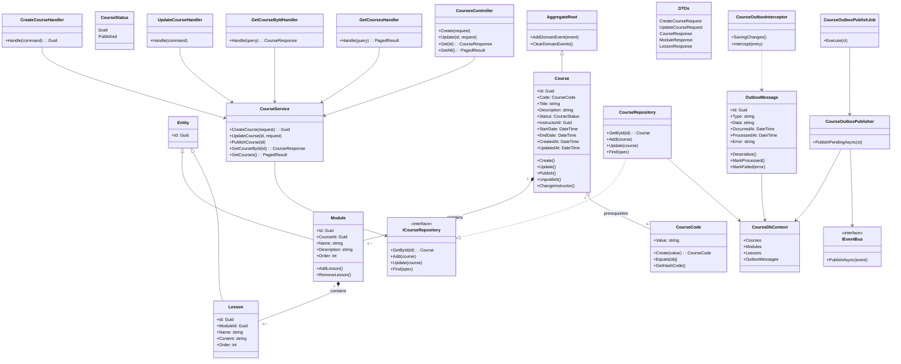

# Courses — Architecture (Domain + Application + Infrastructure)

This file contains the Mermaid class diagram for the Courses module (domain, application, and infrastructure layers).

```mermaid
classDiagram

    %% ========== DOMAIN LAYER ==========
    class AggregateRoot {
        +AddDomainEvent(event)
        +ClearDomainEvents()
    }

    class Entity {
        +Id: Guid
    }

    class Course {
        +Id: Guid
        +Code: CourseCode
        +Title: string
        +Description: string
        +Status: CourseStatus
        +InstructorId: Guid
        +StartDate: DateTime
        +EndDate: DateTime
        +CreatedAt: DateTime
        +UpdatedAt: DateTime
        +Create()
        +Update()
        +Publish()
        +Unpublish()
        +ChangeInstructor()
    }

    class Module {
        +Id: Guid
        +CourseId: Guid
        +Name: string
        +Description: string
        +Order: int
        +AddLesson()
        +RemoveLesson()
    }

    class Lesson {
        +Id: Guid
        +ModuleId: Guid
        +Name: string
        +Content: string
        +Order: int
    }

    class CourseCode {
        +Value: string
        +Create(value): CourseCode
        +Equals(obj)
        +GetHashCode()
    }

    class CourseStatus {
        Draft
        Published
    }

    %% ========== APPLICATION LAYER ==========
    class ICourseRepository {
        <<interface>>
        +GetById(id): Course
        +Add(course)
        +Update(course)
        +Find(spec)
    }

    class CourseService {
        +CreateCourse(request): Guid
        +UpdateCourse(id, request)
        +PublishCourse(id)
        +GetCourseById(id): CourseResponse
        +GetCourses(): PagedResult
    }

    class CreateCourseHandler {
        +Handle(command): Guid
    }

    class UpdateCourseHandler {
        +Handle(command)
    }

    class GetCourseByIdHandler {
        +Handle(query): CourseResponse
    }

    class GetCoursesHandler {
        +Handle(query): PagedResult
    }

    class CoursesController {
        +Create(request)
        +Update(id, request)
        +Get(id): CourseResponse
        +GetAll(): PagedResult
    }

    class DTOs {
        CreateCourseRequest
        UpdateCourseRequest
        CourseResponse
        ModuleResponse
        LessonResponse
    }

    %% ========== INFRASTRUCTURE LAYER ==========
    class CourseDbContext {
        +Courses
        +Modules
        +Lessons
        +OutboxMessages
    }

    class CourseRepository {
        +GetById(id): Course
        +Add(course)
        +Update(course)
        +Find(spec)
    }

    class OutboxMessage {
        +Id: Guid
        +Type: string
        +Data: string
        +OccurredAt: DateTime
        +ProcessedAt: DateTime
        +Error: string
        +Deserialize()
        +MarkProcessed()
        +MarkFailed(error)
    }

    class CourseOutboxInterceptor {
        +SavingChanges()
        +Intercept(entry)
    }

    class CourseOutboxPublisher {
        +PublishPendingAsync(ct)
    }

    class CourseOutboxPublishJob {
        +Execute(ct)
    }

    class IEventBus {
        <<interface>>
        +PublishAsync(event)
    }

    %% ========== RELATIONSHIPS ==========
    AggregateRoot <|-- Course
    Entity <|-- Module
    Entity <|-- Lesson

    Course "1" *-- "0..*" Module : contains
    Module "1" *-- "0..*" Lesson : contains
    Course "1" o-- "0..*" CourseCode : prerequisites

    CourseRepository ..|> ICourseRepository
    CourseRepository --> CourseDbContext
    CourseService --> ICourseRepository
    CreateCourseHandler --> CourseService
    UpdateCourseHandler --> CourseService
    GetCourseByIdHandler --> CourseService
    GetCoursesHandler --> CourseService
    CoursesController --> CourseService

    CourseOutboxInterceptor ..> OutboxMessage
    OutboxMessage --> CourseDbContext
    CourseOutboxPublisher --> CourseDbContext
    CourseOutboxPublisher --> IEventBus
    CourseOutboxPublishJob --> CourseOutboxPublisher

```
