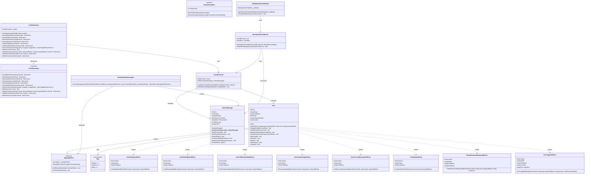

```mermaid
classDiagram
    %% Shared Kernel
    class AggregateRoot {
        <<abstract>>
        -List~object~ _domainEvents
        +IReadOnlyCollection~object~ DomainEvents
        #AddDomainEvent(object domainEvent) void
        +ClearDomainEvents() void
    }

    %% Aggregate Root
    class User {
        +Guid Id
        +string Email
        +string FullName
        +Role Role
        +string PasswordHash
        +bool IsActive
        -User()
        +User(Guid id, string email, string fullName, Role role, string passwordHash)
        +ChangeRole(Role newRole) void
        +UpdateEmail(string email) void
        +UpdateFullName(string fullName) void
        +ChangePassword(string passwordHash) void
        +Deactivate() void
        +Activate() void
        +Delete() void
        +IsInstructor() bool
        +IsAdmin() bool
    }

    %% Value Objects / Enums
    class Role {
        <<enumeration>>
        Student = 0
        Instructor = 1
        Admin = 2
    }

    %% Domain Events
    class UserRegisteredEvent {
        +Guid UserId
        +string Email
        +string FullName
        +UserRegisteredEvent(Guid userId, string email, string fullName)
    }

    class UserEmailUpdatedEvent {
        +Guid UserId
        +string Email
        +string FullName
        +UserEmailUpdatedEvent(Guid userId, string email, string fullName)
    }

    class UserFullNameUpdatedEvent {
        +Guid UserId
        +string Email
        +string FullName
        +UserFullNameUpdatedEvent(Guid userId, string email, string fullName)
    }

    class PasswordChangedEvent {
        +Guid UserId
        +string Email
        +string FullName
        +PasswordChangedEvent(Guid userId, string email, string fullName)
    }

    class UserAccountDeactivatedEvent {
        +Guid UserId
        +string Email
        +string FullName
        +UserAccountDeactivatedEvent(Guid userId, string email, string fullName)
    }

    class UserDeletedEvent {
        +Guid UserId
        +string Email
        +string FullName
        +UserDeletedEvent(Guid userId, string email, string fullName)
    }

    class ResetPasswordRequestedEvent {
        +Guid UserId
        +string Email
        +string FullName
        +string ResetLink
        +ResetPasswordRequestedEvent(Guid userId, string email, string fullName, string resetLink)
    }

    class UserLoggedInEvent {
        +Guid UserId
        +string Email
        +string FullName
        +string Location
        +DateTime LoginTime
        +UserLoggedInEvent(Guid userId, string email, string fullName, string location, DateTime loginTime)
    }

    %% Repository Interface
    class IUserRepository {
        <<interface>>
        +ExistsByEmailAsync(string email) Task~bool~
        +ExistsByIdAsync(Guid id) Task~bool~
        +DeactivateUserAccount(Guid id) Task~User~
        +ActivateUserAccount(Guid id) Task~User~
        +GetUserByIdAsync(Guid id) Task~User?~
        +GetUserByEmailAsync(string email) Task~User?~
        +SearchUsersAsync(string query, int page, int pageSize) Task~PagedResult~User~~
        +AddAsync(User user) Task
        +UpdateUserAsync(string? email, string? fullName, string? passwordHash, Guid id) Task~User~
        +UpdateUserRoleAsync(Role role, Guid id) Task~User~
        +DeleteUserAsync(Guid userId) Task~User~
    }

    %% Domain Exception
    class DomainException {
        <<abstract>>
        +int StatusCode
        #DomainException(string message)
        #DomainException(string message, Exception innerException)
    }

    %% Infrastructure - Outbox
    class OutboxMessage {
        +Guid Id
        +string Type
        +string Payload
        +DateTime OccurredAt
        +DateTime? ProcessedAt
        +int RetryCount
        +string? Error
        -OutboxMessage()
        +FromEvent(object event)$ OutboxMessage
        +MarkProcessed() void
        +MarkFailed(string error) void
        +ShouldRetry() bool
        +HasExceededMaxRetries() bool
        +MarkAsDeadLetter(string reason) void
        +Deserialize() object?
    }

    class IdentityOutboxInterceptor {
        +SavingChangesAsync(DbContextEventData eventData, InterceptionResult~int~ result, CancellationToken cancellationToken) ValueTask~InterceptionResult~int~~
    }

    class IdentityOutboxPublisher {
        -UserDbContext _db
        -IEventBus _eventBus
        +IdentityOutboxPublisher(UserDbContext db, IEventBus eventBus)
        +PublishPendingAsync(CancellationToken ct) Task
    }

    class IdentityOutboxPublishJob {
        -IdentityOutboxPublisher _publisher
        +IdentityOutboxPublishJob(IdentityOutboxPublisher publisher)
        +Execute(IJobExecutionContext context) Task
    }

    %% Persistence
    class UserDbContext {
        +DbSet~User~ Users
        +DbSet~OutboxMessage~ OutboxMessages
        +UserDbContext(DbContextOptions~UserDbContext~ options)
        #OnModelCreating(ModelBuilder modelBuilder) void
    }

    class UserRepository {
        -UserDbContext _context
        +UserRepository(UserDbContext context)
        +ExistsByEmailAsync(string email) Task~bool~
        +ExistsByIdAsync(Guid id) Task~bool~
        +DeactivateUserAccount(Guid id) Task~User~
        +ActivateUserAccount(Guid id) Task~User~
        +GetUserByIdAsync(Guid id) Task~User?~
        +GetUserByEmailAsync(string email) Task~User?~
        +SearchUsersAsync(string query, int page, int pageSize) Task~PagedResult~User~~
        +AddAsync(User user) Task
        +UpdateUserAsync(string? email, string? fullName, string? passwordHash, Guid id) Task~User~
        +UpdateUserRoleAsync(Role role, Guid id) Task~User~
        +DeleteUserAsync(Guid userId) Task~User~
    }

    %% Relationships
    User --|> AggregateRoot : inherits
    User --> Role : uses
    User ..> UserRegisteredEvent : creates
    User ..> UserEmailUpdatedEvent : creates
    User ..> UserFullNameUpdatedEvent : creates
    User ..> PasswordChangedEvent : creates
    User ..> UserAccountDeactivatedEvent : creates
    User ..> UserDeletedEvent : creates
    User ..> ResetPasswordRequestedEvent : creates
    User ..> UserLoggedInEvent : creates
    
    UserRepository ..|> IUserRepository : implements
    UserRepository --> UserDbContext : uses
    UserDbContext --> User : manages
    UserDbContext --> OutboxMessage : manages
    
    IdentityOutboxInterceptor --> OutboxMessage : creates
    IdentityOutboxInterceptor --> AggregateRoot : intercepts
    IdentityOutboxPublisher --> OutboxMessage : processes
    IdentityOutboxPublisher --> UserDbContext : uses
    IdentityOutboxPublishJob --> IdentityOutboxPublisher : uses

    %% Styling
    classDef aggregate fill:#e1f5fe
    classDef valueObject fill:#f3e5f5
    classDef domainEvent fill:#e8f5e8
    classDef repository fill:#fff3e0
    classDef infrastructure fill:#fce4ec
    classDef exception fill:#ffebee
```
