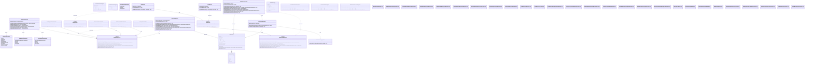

# Notification Module Class Diagram

This diagram shows the architecture of the Notification module following Clean Architecture patterns with event-driven design.

```mermaid
classDiagram
    %% =========================================================
    %% API LAYER
    %% =========================================================
    class NotificationController {
        -INotificationServices _notificationServices
        +GetNotificationByUserId(GetNotificationRequest request) Task~IActionResult~
        +MarkAsReadAsync(string id) Task~IActionResult~
        +GetNotificationByIdAsync(string id) Task~IActionResult~
        +SearchUserAsync(SearchNotificationRequest request) Task~IActionResult~
        +DeleteNotificationAsync(string id) Task~IActionResult~
        +MarkAllAsReadNotificationAsync() Task~IActionResult~
    }

    %% =========================================================
    %% APPLICATION LAYER - DTOs
    %% =========================================================
    class NotificationResponse {
        +Guid Id
        +Guid UserId
        +string Title
        +string Message
        +NotificationType Type
        +bool IsRead
        +DateTime CreatedAt
        +DateTime? ReadAt
    }

    class CreateNotificationRequest {
        +Guid UserId
        +string Title
        +string Message
        +NotificationType Type
    }

    class GetNotificationRequest {
        +int Page
        +int PageSize
    }

    class GetNotificationResponse {
        +List~NotificationResponse~ Notification
        +int Total
        +int Page
        +int PageSize
    }

    class SearchNotificationRequest {
        +string Query
        +int Page
        +int PageSize
    }

    class SearchNotificationResponse {
        +List~NotificationResponse~ Data
        +int Total
        +int Page
        +int PageSize
    }

    %% =========================================================
    %% APPLICATION LAYER - SERVICES
    %% =========================================================
    class INotificationServices {
        <<interface>>
        +CreateNotificationAsync(Notifications notification) Task
        +GetNotificationsByUserIdAsync(string userId, GetNotificationRequest request) Task~GetNotificationResponse~
        +MarkAsReadAsync(string nId, string uId) Task~NotificationResponse~
        +GetNotificationByIdAsync(string nId, string uId) Task~NotificationResponse~
        +SearchNotificationsAsync(SearchNotificationRequest request, string userId) Task~SearchNotificationResponse~
        +DeleteNotificationAsync(string nId, string uId) Task
        +MarkAllAsReadNotificationAsync(string uId) Task
    }

    class NotificationServices {
        -INotificationRepository _notificationRepository
        -ILogger~NotificationServices~ _logger
        +CreateNotificationAsync(Notifications notification) Task
        +GetNotificationsByUserIdAsync(string userId, GetNotificationRequest request) Task~GetNotificationResponse~
        +MarkAsReadAsync(string nId, string uId) Task~NotificationResponse~
        +GetNotificationByIdAsync(string nId, string uId) Task~NotificationResponse~
        +SearchNotificationsAsync(SearchNotificationRequest request, string userId) Task~SearchNotificationResponse~
        +DeleteNotificationAsync(string nId, string uId) Task
        +MarkAllAsReadNotificationAsync(string uId) Task
    }

    class IEmailServices {
        <<interface>>
        +SendEmailAsync(string to, string subject, string body) Task
    }

    class EmailService {
        -IEmailSender _emailSender
        -ILogger~EmailService~ _logger
        +SendEmailAsync(string to, string subject, string body) Task
    }

    %% =========================================================
    %% APPLICATION LAYER - EVENT HANDLERS
    %% =========================================================
    class UserRegisteredEventHandler {
        -INotificationServices _notificationServices
        +Handle(UserRegisteredEvent @event) Task
    }

    class CourseCreatedEventHandler {
        -INotificationServices _notificationServices
        +Handle(CourseCreatedEvent @event) Task
    }

    class StudentEnrolledEventHandler {
        -INotificationServices _notificationServices
        +Handle(StudentEnrolledEvent @event) Task
    }

    class GradingEventHandler {
        -INotificationServices _notificationServices
        +Handle(GradeRecordedEvent @event) Task
    }

    %% =========================================================
    %% DOMAIN LAYER - ENTITIES
    %% =========================================================
    class Notifications {
        +Guid Id
        +Guid UserId
        +string Title
        +string Message
        +NotificationType Type
        +bool IsRead
        +DateTime CreatedAt
        +DateTime? ReadAt
        -Notifications()
        +Notifications(Guid userId, string title, string message, NotificationType type)
        +MarkAsRead() void
    }

    %% =========================================================
    %% DOMAIN LAYER - ENUMS
    %% =========================================================
    class NotificationType {
        <<enumeration>>
        Info
        Warning
        Success
        Error
        Reminder
    }

    %% =========================================================
    %% DOMAIN LAYER - REPOSITORIES
    %% =========================================================
    class INotificationRepository {
        <<interface>>
        +CreateNotificationAsync(Notifications notification) Task
        +GetNotificationByUserIdAsync(Guid userId, int page, int pageSize) Task~(IEnumerable~Notifications~ Items, int TotalCount)~
        +MarkAsReadAsync(Guid notificationId, Guid userId) Task~Notifications~
        +GetNotificationByIdAsync(Guid notificationId, Guid userId) Task~Notifications~
        +SearchNotificationsAsync(string query, int page, int pageSize, Guid userId) Task~(IEnumerable~Notifications~ Items, int TotalCount)~
        +DeleteNotificationAsync(Guid notificationId, Guid userId) Task
        +MarkAllAsReadNotificationAsync(Guid userId) Task
    }

    class IEmailSender {
        <<interface>>
        +SendEmailAsync(string to, string subject, string body) Task
    }

    %% =========================================================
    %% INFRASTRUCTURE LAYER - PERSISTENCE
    %% =========================================================
    class NotificationDbContext {
        +DbSet~Notifications~ Notifications
        +NotificationDbContext(DbContextOptions~NotificationDbContext~ options)
        #OnModelCreating(ModelBuilder modelBuilder) void
    }

    class NotificationConfiguration {
        +Configure(EntityTypeBuilder~Notifications~ builder) void
    }

    class NotificationRepository {
        -NotificationDbContext _context
        -ILogger~NotificationRepository~ _logger
        +CreateNotificationAsync(Notifications notification) Task
        +GetNotificationByUserIdAsync(Guid userId, int page, int pageSize) Task~(IEnumerable~Notifications~, int)~
        +MarkAsReadAsync(Guid notificationId, Guid userId) Task~Notifications~
        +GetNotificationByIdAsync(Guid notificationId, Guid userId) Task~Notifications~
        +SearchNotificationsAsync(string query, int page, int pageSize, Guid userId) Task~(IEnumerable~Notifications~, int)~
        +DeleteNotificationAsync(Guid notificationId, Guid userId) Task
        +MarkAllAsReadNotificationAsync(Guid userId) Task
    }

    %% =========================================================
    %% INFRASTRUCTURE LAYER - EMAIL
    %% =========================================================
    class EmailSender {
        -IConfiguration _configuration
        -ILogger~EmailSender~ _logger
        +SendEmailAsync(string to, string subject, string body) Task
    }

    %% =========================================================
    %% INFRASTRUCTURE LAYER - OUTBOX
    %% =========================================================
    class OutboxMessage {
        +Guid Id
        +string Type
        +string Content
        +DateTime OccurredOn
        +DateTime? ProcessedOn
        +string? Error
    }

    %% =========================================================
    %% APPLICATION LAYER - EXCEPTIONS
    %% =========================================================
    class CreateNotificationException {
        +CreateNotificationException(string message)
        +CreateNotificationException(string message, Exception innerException)
    }

    class GetNotificationException {
        +GetNotificationException(string message)
        +GetNotificationException(string message, Exception innerException)
    }

    class NotificationNotFoundException {
        +NotificationNotFoundException(string message)
        +NotificationNotFoundException(string message, Exception innerException)
    }

    %% =========================================================
    %% RELATIONSHIPS
    %% =========================================================
    
    %% API Dependencies
    NotificationController --> INotificationServices : uses
    NotificationController ..> NotificationResponse : returns
    NotificationController ..> GetNotificationResponse : returns
    NotificationController ..> SearchNotificationResponse : returns

    %% Service Dependencies
    NotificationServices ..|> INotificationServices : implements
    NotificationServices --> INotificationRepository : uses
    NotificationServices --> Notifications : manages
    EmailService ..|> IEmailServices : implements
    EmailService --> IEmailSender : uses

    %% Event Handler Dependencies
    UserRegisteredEventHandler --> INotificationServices : uses
    CourseCreatedEventHandler --> INotificationServices : uses
    StudentEnrolledEventHandler --> INotificationServices : uses
    GradingEventHandler --> INotificationServices : uses

    %% Repository Implementation
    NotificationRepository ..|> INotificationRepository : implements
    NotificationRepository --> NotificationDbContext : uses
    NotificationRepository --> Notifications : manages

    %% Infrastructure Dependencies
    EmailSender ..|> IEmailSender : implements
    NotificationDbContext --> Notifications : maps
    NotificationDbContext --> NotificationConfiguration : uses

    %% Domain Model
    Notifications --> NotificationType : uses

    %% =========================================================
    %% STYLING
    %% =========================================================
    classDef apiLayer fill:#e3f2fd,stroke:#1976d2,stroke-width:2px
    classDef applicationLayer fill:#f3e5f5,stroke:#7b1fa2,stroke-width:2px
    classDef domainLayer fill:#e8f5e8,stroke:#388e3c,stroke-width:2px
    classDef infrastructureLayer fill:#fff3e0,stroke:#f57c00,stroke-width:2px

    %% API Layer
    class NotificationController apiLayer

    %% Application Layer
    class NotificationResponse applicationLayer
    class CreateNotificationRequest applicationLayer
    class GetNotificationRequest applicationLayer
    class GetNotificationResponse applicationLayer
    class SearchNotificationRequest applicationLayer
    class SearchNotificationResponse applicationLayer
    class INotificationServices applicationLayer
    class NotificationServices applicationLayer
    class IEmailServices applicationLayer
    class EmailService applicationLayer
    class UserRegisteredEventHandler applicationLayer
    class CourseCreatedEventHandler applicationLayer
    class StudentEnrolledEventHandler applicationLayer
    class GradingEventHandler applicationLayer
    class CreateNotificationException applicationLayer
    class GetNotificationException applicationLayer
    class NotificationNotFoundException applicationLayer

    %% Domain Layer
    class Notifications domainLayer
    class NotificationType domainLayer
    class INotificationRepository domainLayer
    class IEmailSender domainLayer

    %% Infrastructure Layer
    class NotificationDbContext infrastructureLayer
    class NotificationConfiguration infrastructureLayer
    class NotificationRepository infrastructureLayer
    class EmailSender infrastructureLayer
    class OutboxMessage infrastructureLayer
```